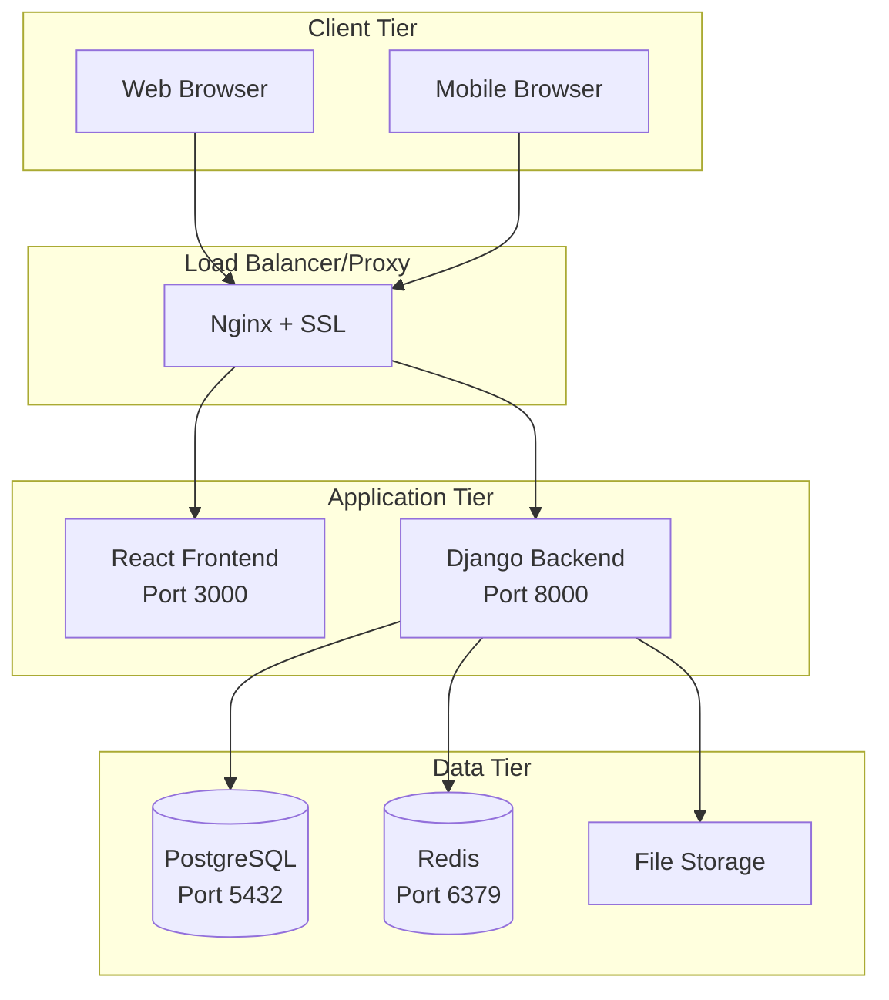
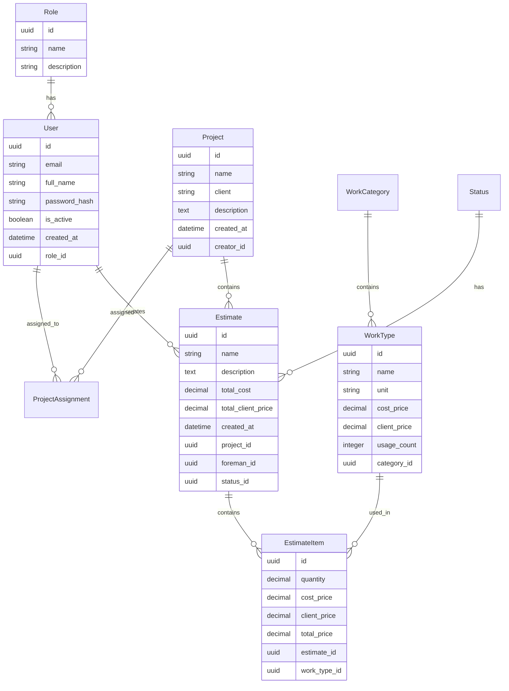
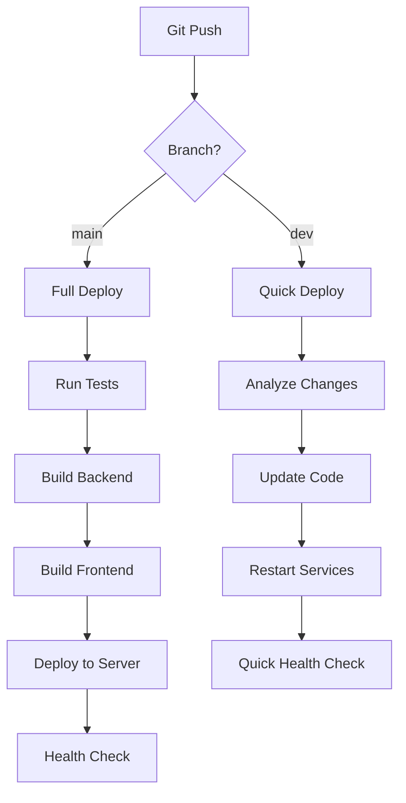
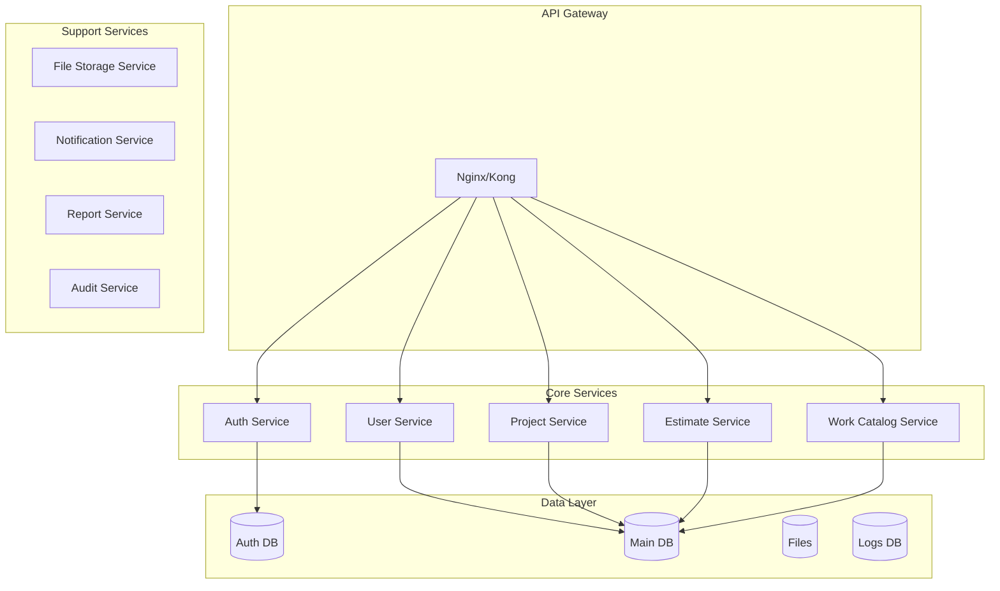

# 🏗️ Архитектура системы

Детальное описание архитектуры приложения управления сметами.

## 📋 Общий обзор

Estimate App - это full-stack веб-приложение для управления строительными сметами с ролевой системой доступа, построенное по микросервисной архитектуре.



## 🎯 Бизнес-логика

### Основные сущности



### Ролевая модель

**Роли пользователей:**
- **Менеджер** - полный доступ ко всем данным
- **Прораб** - доступ только к назначенным проектам

**Права доступа:**
```python
Permissions = {
    'manager': [
        'view_all_projects',
        'create_project',
        'edit_project',
        'delete_project',
        'assign_users_to_projects',
        'view_all_estimates',
        'approve_price_changes',
        'manage_users',
        'export_reports'
    ],
    'foreman': [
        'view_assigned_projects',
        'create_estimates',
        'edit_own_estimates',
        'request_price_changes',
        'view_work_catalog'
    ]
}
```

## 🔧 Backend архитектура

### Django приложение

```
backend/
├── core/                          # Настройки Django
│   ├── settings.py               # Базовые настройки
│   ├── settings_production.py    # Продакшн настройки
│   ├── urls.py                   # Главные URL маршруты
│   └── wsgi.py                   # WSGI точка входа
├── api/                          # Основное приложение
│   ├── models.py                 # Модели данных
│   ├── views.py                  # API endpoints (ViewSets)
│   ├── serializers.py            # DRF сериализаторы
│   ├── permissions.py            # Кастомные разрешения
│   ├── authentication.py         # UUID аутентификация
│   ├── security_decorators.py    # Декораторы безопасности
│   ├── urls.py                   # API маршруты
│   ├── utils.py                  # Утилиты
│   └── management/commands/      # Django команды
│       └── seed_db.py           # Команда наполнения БД
├── requirements.txt              # Зависимости для разработки
├── requirements_production.txt   # Продакшн зависимости
└── manage.py                     # Django CLI
```

### API архитектура

**REST API endpoints:**
```
/api/v1/
├── auth/
│   └── login/                    # POST - аутентификация
├── health/                       # GET - health check
├── statuses/                     # GET - статусы смет
├── roles/                        # GET - роли пользователей
├── users/                        # CRUD - управление пользователями
├── projects/                     # CRUD - проекты
├── project-assignments/          # CRUD - назначения на проекты
├── estimates/                    # CRUD - сметы
│   └── {id}/export/             # GET - экспорт сметы
│       ├── client/              # Экспорт для клиента
│       └── internal/            # Внутренний экспорт
├── work-categories/             # CRUD - категории работ
└── work-types/                  # CRUD - типы работ
    └── import/                  # POST - импорт из Excel
```

**Middleware stack:**
```python
MIDDLEWARE = [
    'corsheaders.middleware.CorsMiddleware',           # CORS
    'django.middleware.security.SecurityMiddleware',   # Безопасность
    'django.middleware.common.CommonMiddleware',       # Общие настройки
    'django.middleware.csrf.CsrfViewMiddleware',       # CSRF защита
    'django.contrib.auth.middleware.AuthenticationMiddleware',  # Аутентификация
    'django.middleware.clickjacking.XFrameOptionsMiddleware',   # Clickjacking защита
]
```

### Система аутентификации

**UUID Token Authentication:**
```python
class UUIDTokenAuthentication(BaseAuthentication):
    """
    Кастомная аутентификация через UUID токены
    """
    def authenticate(self, request):
        auth_header = request.META.get('HTTP_AUTHORIZATION')
        if not auth_header or not auth_header.startswith('Bearer '):
            return None
            
        token = auth_header[7:]  # Remove 'Bearer '
        
        try:
            # Валидация UUID формата
            uuid.UUID(token)
            auth_token = AuthToken.objects.select_related('user').get(token=token)
            
            if not auth_token.user.is_active:
                raise AuthenticationFailed('User inactive')
                
            return (auth_token.user, auth_token)
        except (ValueError, AuthToken.DoesNotExist):
            raise AuthenticationFailed('Invalid token')
```

**Модель токена:**
```python
class AuthToken(models.Model):
    """
    UUID токены для аутентификации пользователей
    """
    id = models.UUIDField(primary_key=True, default=uuid.uuid4)
    token = models.UUIDField(unique=True, default=uuid.uuid4)
    user = models.ForeignKey(User, on_delete=models.CASCADE, related_name='tokens')
    created_at = models.DateTimeField(auto_now_add=True)
    last_used = models.DateTimeField(auto_now=True)
    
    class Meta:
        db_table = 'auth_tokens'
```

### Система безопасности

**Декораторы безопасности:**
```python
def ensure_estimate_access(view_func):
    """Проверяет доступ к смете по роли пользователя"""
    def wrapper(request, *args, **kwargs):
        estimate_id = kwargs.get('estimate_id') or request.data.get('estimate_id')
        if estimate_id:
            estimate = Estimate.objects.get(id=estimate_id)
            if request.user.role.name != 'менеджер' and estimate.foreman != request.user:
                raise PermissionDenied('No access to this estimate')
        return view_func(request, *args, **kwargs)
    return wrapper

def audit_critical_action(action_type):
    """Логирует критические действия пользователей"""
    def decorator(view_func):
        def wrapper(request, *args, **kwargs):
            try:
                result = view_func(request, *args, **kwargs)
                audit_logger.info(f"{action_type} успешно выполнено пользователем {request.user.email}")
                return result
            except Exception as e:
                audit_logger.error(f"Ошибка {action_type}: {str(e)} пользователем {request.user.email}")
                raise
        return wrapper
    return decorator
```

## 🎨 Frontend архитектура

### React приложение

```
frontend/
├── src/
│   ├── api/
│   │   └── client.js             # HTTP клиент + API методы
│   ├── components/               # Переиспользуемые компоненты
│   │   ├── NavMenu.jsx          # Навигационное меню
│   │   └── TransferList.jsx     # Компонент переноса элементов
│   ├── pages/                   # Страницы приложения
│   │   ├── LoginPage.jsx        # Страница входа
│   │   ├── EstimatesList.jsx    # Список смет
│   │   ├── EstimateEditor.jsx   # Редактор сметы
│   │   ├── ProjectsPage.jsx     # Управление проектами
│   │   ├── WorkCategoryPage.jsx # Категории работ
│   │   ├── WorksPage.jsx        # Каталог работ
│   │   ├── UsersPage.jsx        # Управление пользователями
│   │   └── ...
│   ├── App.jsx                  # Главный компонент
│   ├── main.jsx                 # Точка входа
│   └── index.css               # Стили
├── package.json                 # npm зависимости
├── vite.config.js              # Конфигурация Vite
└── nginx.conf                  # Nginx конфиг для контейнера
```

### Управление состоянием

**Централизованное состояние в App.jsx:**
```jsx
const App = () => {
  // Состояние аутентификации
  const [user, setUser] = useState(null);
  const [token, setToken] = useState(localStorage.getItem('token'));
  
  // Основные данные
  const [projects, setProjects] = useState([]);
  const [estimates, setEstimates] = useState([]);
  const [workTypes, setWorkTypes] = useState([]);
  
  // Вспомогательные данные
  const [statuses, setStatuses] = useState([]);
  const [roles, setRoles] = useState([]);
  const [users, setUsers] = useState([]);

  // Черновики (localStorage)
  const [drafts, setDrafts] = useState(
    JSON.parse(localStorage.getItem('estimateDrafts') || '{}')
  );

  // Фильтрация данных по роли
  const filteredProjects = useMemo(() => {
    if (!user) return [];
    if (user.role === 'менеджер') return projects;
    
    // Прораб видит только назначенные проекты
    return projects.filter(project => 
      project.assignments?.some(assignment => assignment.user_id === user.user_id)
    );
  }, [projects, user]);
};
```

### HTTP клиент

**API клиент с автоматической аутентификацией:**
```javascript
// frontend/src/api/client.js
class APIClient {
  constructor() {
    this.baseURL = import.meta.env.VITE_API_BASE_URL;
    this.token = localStorage.getItem('token');
  }

  async request(endpoint, options = {}) {
    const url = `${this.baseURL}${endpoint}`;
    const config = {
      headers: {
        'Content-Type': 'application/json',
        ...(this.token && { Authorization: `Bearer ${this.token}` }),
        ...options.headers,
      },
      ...options,
    };

    try {
      const response = await fetch(url, config);
      
      if (response.status === 401) {
        localStorage.removeItem('token');
        window.location.href = '/login';
        return;
      }

      if (!response.ok) {
        const errorData = await response.json().catch(() => ({}));
        throw new Error(this.parseErrorMessage(errorData));
      }

      return await response.json();
    } catch (error) {
      console.error(`API Error [${endpoint}]:`, error);
      throw error;
    }
  }

  // Методы для каждого API endpoint
  auth = {
    login: (credentials) => this.request('/auth/login/', {
      method: 'POST',
      body: JSON.stringify(credentials),
    }),
  };

  projects = {
    list: () => this.request('/projects/'),
    create: (data) => this.request('/projects/', {
      method: 'POST',
      body: JSON.stringify(data),
    }),
    // ...остальные методы
  };
}

export default new APIClient();
```

## 🗄️ База данных

### PostgreSQL схема

**Основные таблицы:**
```sql
-- Роли пользователей
CREATE TABLE roles (
    id UUID PRIMARY KEY DEFAULT gen_random_uuid(),
    name VARCHAR(50) UNIQUE NOT NULL,
    description TEXT
);

-- Пользователи
CREATE TABLE users (
    id UUID PRIMARY KEY DEFAULT gen_random_uuid(),
    email VARCHAR(255) UNIQUE NOT NULL,
    full_name VARCHAR(255) NOT NULL,
    password_hash VARCHAR(255) NOT NULL,
    is_active BOOLEAN DEFAULT TRUE,
    created_at TIMESTAMP DEFAULT CURRENT_TIMESTAMP,
    role_id UUID REFERENCES roles(id)
);

-- Токены аутентификации
CREATE TABLE auth_tokens (
    id UUID PRIMARY KEY DEFAULT gen_random_uuid(),
    token UUID UNIQUE NOT NULL DEFAULT gen_random_uuid(),
    user_id UUID REFERENCES users(id) ON DELETE CASCADE,
    created_at TIMESTAMP DEFAULT CURRENT_TIMESTAMP,
    last_used TIMESTAMP DEFAULT CURRENT_TIMESTAMP
);

-- Проекты
CREATE TABLE projects (
    id UUID PRIMARY KEY DEFAULT gen_random_uuid(),
    name VARCHAR(255) NOT NULL,
    client VARCHAR(255) NOT NULL,
    description TEXT,
    created_at TIMESTAMP DEFAULT CURRENT_TIMESTAMP,
    creator_id UUID REFERENCES users(id)
);

-- Назначения на проекты
CREATE TABLE project_assignments (
    id UUID PRIMARY KEY DEFAULT gen_random_uuid(),
    project_id UUID REFERENCES projects(id) ON DELETE CASCADE,
    user_id UUID REFERENCES users(id) ON DELETE CASCADE,
    assigned_at TIMESTAMP DEFAULT CURRENT_TIMESTAMP,
    UNIQUE(project_id, user_id)
);

-- Статусы смет
CREATE TABLE statuses (
    id UUID PRIMARY KEY DEFAULT gen_random_uuid(),
    name VARCHAR(100) UNIQUE NOT NULL
);

-- Сметы
CREATE TABLE estimates (
    id UUID PRIMARY KEY DEFAULT gen_random_uuid(),
    name VARCHAR(255),
    description TEXT,
    total_cost DECIMAL(15,2) DEFAULT 0,
    total_client_price DECIMAL(15,2) DEFAULT 0,
    created_at TIMESTAMP DEFAULT CURRENT_TIMESTAMP,
    updated_at TIMESTAMP DEFAULT CURRENT_TIMESTAMP,
    project_id UUID REFERENCES projects(id),
    foreman_id UUID REFERENCES users(id),
    status_id UUID REFERENCES statuses(id)
);

-- Категории работ
CREATE TABLE work_categories (
    id UUID PRIMARY KEY DEFAULT gen_random_uuid(),
    name VARCHAR(255) UNIQUE NOT NULL,
    description TEXT
);

-- Типы работ
CREATE TABLE work_types (
    id UUID PRIMARY KEY DEFAULT gen_random_uuid(),
    name VARCHAR(255) NOT NULL,
    unit VARCHAR(50) NOT NULL,
    cost_price DECIMAL(10,2) NOT NULL,
    client_price DECIMAL(10,2) NOT NULL,
    usage_count INTEGER DEFAULT 0,
    category_id UUID REFERENCES work_categories(id)
);

-- Элементы сметы
CREATE TABLE estimate_items (
    id UUID PRIMARY KEY DEFAULT gen_random_uuid(),
    quantity DECIMAL(10,3) NOT NULL,
    cost_price DECIMAL(10,2) NOT NULL,
    client_price DECIMAL(10,2) NOT NULL,
    total_price DECIMAL(15,2) NOT NULL,
    estimate_id UUID REFERENCES estimates(id) ON DELETE CASCADE,
    work_type_id UUID REFERENCES work_types(id)
);
```

### Индексы для производительности

```sql
-- Индексы для быстрого поиска
CREATE INDEX idx_users_email ON users(email);
CREATE INDEX idx_auth_tokens_token ON auth_tokens(token);
CREATE INDEX idx_auth_tokens_user ON auth_tokens(user_id);
CREATE INDEX idx_projects_creator ON projects(creator_id);
CREATE INDEX idx_estimates_project ON estimates(project_id);
CREATE INDEX idx_estimates_foreman ON estimates(foreman_id);
CREATE INDEX idx_estimate_items_estimate ON estimate_items(estimate_id);
CREATE INDEX idx_estimate_items_work_type ON estimate_items(work_type_id);
CREATE INDEX idx_work_types_category ON work_types(category_id);
CREATE INDEX idx_project_assignments_project ON project_assignments(project_id);
CREATE INDEX idx_project_assignments_user ON project_assignments(user_id);

-- Композитные индексы
CREATE INDEX idx_estimates_foreman_status ON estimates(foreman_id, status_id);
CREATE INDEX idx_work_types_category_usage ON work_types(category_id, usage_count DESC);
```

## 🐳 Containerization

### Docker архитектура

```yaml
# docker-compose.production.yml
version: '3.8'

services:
  # PostgreSQL (опционально)
  postgres:
    image: postgres:15
    container_name: estimate-postgres
    environment:
      POSTGRES_DB: estimate_app_db
      POSTGRES_USER: estimate_user
      POSTGRES_PASSWORD: secure_password_123
    volumes:
      - postgres_data:/var/lib/postgresql/data
    networks:
      - estimate_network
    profiles:
      - new-db

  # Django Backend
  backend:
    image: estimate-app-backend:latest
    container_name: estimate-backend
    ports:
      - "8000:8000"
    environment:
      - DATABASE_URL=${DATABASE_URL}
      - SECRET_KEY=${SECRET_KEY}
      - SSL_ENABLED=${SSL_ENABLED}
    extra_hosts:
      - "host.docker.internal:host-gateway"
    volumes:
      - ./logs:/app/logs
      - static_files:/app/staticfiles
      - media_files:/app/media
    networks:
      - estimate_network

  # React Frontend
  frontend:
    image: estimate-app-frontend:latest
    container_name: estimate-frontend
    ports:
      - "3000:80"
    environment:
      - VITE_API_BASE_URL=${VITE_API_BASE_URL}
    networks:
      - estimate_network

  # Redis (опционально)
  redis:
    image: redis:7-alpine
    container_name: estimate-redis
    ports:
      - "6379:6379"
    command: redis-server --requirepass ${REDIS_PASSWORD}
    volumes:
      - redis_data:/data
    networks:
      - estimate_network
    profiles:
      - cache

networks:
  estimate_network:
    external: true

volumes:
  postgres_data:
  static_files:
  media_files:
  redis_data:
```

### Nginx конфигурация

**Системный Nginx как reverse proxy:**
```nginx
# /etc/nginx/sites-available/app.iqbs.pro-ssl.conf
server {
    listen 443 ssl http2;
    server_name app.iqbs.pro;

    # SSL Configuration
    ssl_certificate /etc/letsencrypt/live/app.iqbs.pro/fullchain.pem;
    ssl_certificate_key /etc/letsencrypt/live/app.iqbs.pro/privkey.pem;

    # Frontend (React SPA)
    location / {
        proxy_pass http://localhost:3000;
        proxy_set_header Host $host;
        proxy_set_header X-Real-IP $remote_addr;
        proxy_set_header X-Forwarded-For $proxy_add_x_forwarded_for;
        proxy_set_header X-Forwarded-Proto $scheme;
        
        # WebSocket поддержка для hot reload
        proxy_http_version 1.1;
        proxy_set_header Upgrade $http_upgrade;
        proxy_set_header Connection 'upgrade';
        proxy_cache_bypass $http_upgrade;
    }

    # Backend API
    location /api/ {
        proxy_pass http://localhost:8000;
        proxy_set_header Host $host;
        proxy_set_header X-Real-IP $remote_addr;
        proxy_set_header X-Forwarded-For $proxy_add_x_forwarded_for;
        proxy_set_header X-Forwarded-Proto $scheme;
        
        # CORS headers
        add_header Access-Control-Allow-Origin "https://app.iqbs.pro" always;
        add_header Access-Control-Allow-Methods "GET, POST, PUT, DELETE, OPTIONS" always;
        add_header Access-Control-Allow-Headers "Accept, Authorization, Content-Type, X-Requested-With" always;
        add_header Access-Control-Allow-Credentials true always;
        
        if ($request_method = 'OPTIONS') {
            return 204;
        }
    }

    # Статические файлы Django
    location /static/ {
        alias /var/www/estimate-app/static/;
        expires 1y;
        add_header Cache-Control "public, immutable";
    }

    # Загруженные файлы
    location /media/ {
        alias /var/www/estimate-app/media/;
        expires 1y;
        add_header Cache-Control "public";
    }
}
```

## 🔄 CI/CD пайплайн

### GitHub Actions workflow



**Полный деплой (main):**
1. **Tests** - запуск всех тестов с PostgreSQL
2. **Build** - сборка Docker образов для backend и frontend
3. **Deploy** - передача образов на сервер и развертывание
4. **Health Check** - проверка работоспособности

**Быстрый деплой (dev):**
1. **Analyze** - определение типа изменений
2. **Deploy** - обновление только измененного кода
3. **Health Check** - базовая проверка

## 🔐 Безопасность

### Многоуровневая защита

**1. Сетевая безопасность:**
- SSL/TLS шифрование (Let's Encrypt)
- HTTP to HTTPS редирект
- Настроенный firewall (ufw)
- Fail2ban для защиты от брутфорса

**2. Аутентификация и авторизация:**
- UUID токены вместо JWT (сложнее подделать)
- Ролевая система доступа
- Проверка прав на уровне API endpoints
- Аудит всех критических действий

**3. Безопасность приложения:**
- CSRF защита
- XSS защита через Content-Security-Policy
- SQL injection защита через ORM
- Валидация всех входных данных

**4. Безопасность данных:**
- Хеширование паролей (bcrypt)
- Маскировка чувствительных данных в логах
- Резервное копирование БД
- Ограничение размера файлов

### Мониторинг безопасности

```python
# Логирование подозрительной активности
security_logger = logging.getLogger('security')

def log_security_event(event_type, user, details):
    security_logger.warning(
        f"Security Event: {event_type} | "
        f"User: {user.email if user else 'Anonymous'} | "
        f"IP: {get_client_ip(request)} | "
        f"Details: {details}"
    )

# Примеры событий:
# - Неудачные попытки входа
# - Доступ к запрещенным ресурсам  
# - Подозрительные изменения данных
# - Массовые операции
```

## 📊 Производительность

### Оптимизации базы данных

**Индексирование:**
- Индексы на часто используемые поля
- Композитные индексы для сложных запросов
- Регулярный анализ производительности запросов

**Оптимизация запросов:**
```python
# Использование select_related и prefetch_related
estimates = Estimate.objects.select_related(
    'project', 'foreman', 'status'
).prefetch_related(
    'estimate_items__work_type__category'
)

# Аннотации для агрегированных данных
estimates = estimates.annotate(
    items_count=Count('estimate_items'),
    total_cost=Sum('estimate_items__total_price')
)
```

### Кеширование

**Redis кеш:**
```python
from django.core.cache import cache

# Кеширование справочных данных
def get_work_types():
    cache_key = 'work_types_all'
    work_types = cache.get(cache_key)
    
    if work_types is None:
        work_types = list(WorkType.objects.select_related('category'))
        cache.set(cache_key, work_types, 3600)  # 1 час
    
    return work_types
```

### Frontend оптимизации

**Code splitting:**
```javascript
// Lazy loading страниц
const EstimateEditor = lazy(() => import('./pages/EstimateEditor'));
const WorksPage = lazy(() => import('./pages/WorksPage'));

// Chunk splitting в Vite
export default defineConfig({
  build: {
    rollupOptions: {
      output: {
        manualChunks: {
          vendor: ['react', 'react-dom'],
          mui: ['@mui/material', '@mui/icons-material']
        }
      }
    }
  }
});
```

## 📈 Масштабируемость

### Горизонтальное масштабирование

**Load Balancer + Multiple Instances:**
```nginx
upstream backend_servers {
    server estimate-backend-1:8000;
    server estimate-backend-2:8000;
    server estimate-backend-3:8000;
}

upstream frontend_servers {
    server estimate-frontend-1:80;
    server estimate-frontend-2:80;
}

server {
    location /api/ {
        proxy_pass http://backend_servers;
    }
    
    location / {
        proxy_pass http://frontend_servers;
    }
}
```

### Микросервисная архитектура (будущее)



---

**Следующий раздел**: [🚀 Быстрый старт](./quick-start.md)