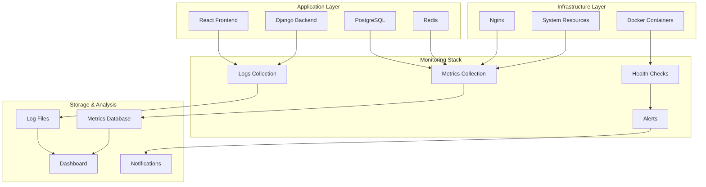

# 📈 Мониторинг и логирование

Комплексное руководство по мониторингу производительности, логированию и диагностике системы.

## 📊 Архитектура мониторинга



## 📝 Система логирования

### Структура логов

```
/var/log/
├── nginx/                          # Nginx логи
│   ├── app.iqbs.pro.access.log    # HTTP запросы
│   ├── app.iqbs.pro.error.log     # Ошибки nginx
│   └── error.log                   # Общие ошибки nginx
├── docker/                         # Docker логи (через journald)
└── system/                         # Системные логи
    ├── auth.log                    # Аутентификация
    ├── syslog                      # Системные события
    └── fail2ban.log               # Блокировки fail2ban

/var/www/estimate-app/logs/         # Логи приложения (в контейнерах)
├── django.log                      # Django application
├── security.log                    # События безопасности
├── audit.log                      # Аудит действий пользователей
└── performance.log                 # Метрики производительности
```

### Конфигурация логирования Django

```python
# backend/core/settings_production.py
LOGGING = {
    'version': 1,
    'disable_existing_loggers': False,
    'formatters': {
        'verbose': {
            'format': '{levelname} {asctime} {name} {process:d} {thread:d} {message}',
            'style': '{',
        },
        'json': {
            'format': '{"timestamp": "{asctime}", "level": "{levelname}", "logger": "{name}", "message": "{message}", "module": "{module}", "funcName": "{funcName}", "lineno": {lineno}}',
            'style': '{',
        },
        'security': {
            'format': '[SECURITY] {asctime} {levelname} {message} | User: {user} | IP: {ip} | Action: {action}',
            'style': '{',
        },
    },
    'handlers': {
        'console': {
            'level': 'INFO',
            'class': 'logging.StreamHandler',
            'formatter': 'verbose',
        },
        'security_console': {
            'level': 'WARNING',
            'class': 'logging.StreamHandler',
            'formatter': 'security',
        },
        'audit_console': {
            'level': 'INFO',
            'class': 'logging.StreamHandler',
            'formatter': 'json',
        },
    },
    'root': {
        'handlers': ['console'],
        'level': 'INFO',
    },
    'loggers': {
        'django': {
            'handlers': ['console'],
            'level': 'INFO',
            'propagate': False,
        },
        'security': {
            'handlers': ['security_console'],
            'level': 'WARNING',
            'propagate': False,
        },
        'audit': {
            'handlers': ['audit_console'],
            'level': 'INFO',
            'propagate': False,
        },
        'api': {
            'handlers': ['console'],
            'level': 'INFO',
            'propagate': False,
        },
    },
}
```

### Кастомные логгеры

```python
# backend/api/utils.py
import logging
import json
from django.utils import timezone

# Настройка логгеров
security_logger = logging.getLogger('security')
audit_logger = logging.getLogger('audit')
performance_logger = logging.getLogger('performance')

class SecurityLogger:
    """Логгер событий безопасности"""
    
    @staticmethod
    def log_authentication_attempt(user_email, ip_address, success=True, details=None):
        level = logging.INFO if success else logging.WARNING
        message = f"Authentication {'successful' if success else 'failed'}"
        
        security_logger.log(
            level,
            message,
            extra={
                'user': user_email,
                'ip': ip_address,
                'action': 'authentication',
                'success': success,
                'details': details or {}
            }
        )
    
    @staticmethod
    def log_permission_denied(user, resource, action, ip_address):
        security_logger.warning(
            f"Access denied to {resource}",
            extra={
                'user': user.email if user else 'Anonymous',
                'ip': ip_address,
                'action': f'access_denied_{action}',
                'resource': resource
            }
        )
    
    @staticmethod
    def log_suspicious_activity(description, user, ip_address, details=None):
        security_logger.error(
            f"Suspicious activity: {description}",
            extra={
                'user': user.email if user else 'Anonymous',
                'ip': ip_address,
                'action': 'suspicious_activity',
                'details': details or {}
            }
        )

class AuditLogger:
    """Логгер действий пользователей"""
    
    @staticmethod
    def log_user_action(user, action, resource_type, resource_id=None, details=None):
        audit_data = {
            'timestamp': timezone.now().isoformat(),
            'user_id': str(user.id) if user else None,
            'user_email': user.email if user else 'Anonymous',
            'action': action,
            'resource_type': resource_type,
            'resource_id': str(resource_id) if resource_id else None,
            'details': details or {}
        }
        
        audit_logger.info(json.dumps(audit_data))
    
    @staticmethod
    def log_data_change(user, model_name, instance_id, changes, ip_address):
        audit_data = {
            'timestamp': timezone.now().isoformat(),
            'user_id': str(user.id),
            'user_email': user.email,
            'action': 'data_change',
            'model': model_name,
            'instance_id': str(instance_id),
            'changes': changes,
            'ip_address': ip_address
        }
        
        audit_logger.info(json.dumps(audit_data))

class PerformanceLogger:
    """Логгер метрик производительности"""
    
    @staticmethod
    def log_api_performance(endpoint, method, duration, status_code, user=None):
        performance_data = {
            'timestamp': timezone.now().isoformat(),
            'endpoint': endpoint,
            'method': method,
            'duration_ms': round(duration * 1000, 2),
            'status_code': status_code,
            'user_id': str(user.id) if user else None
        }
        
        performance_logger.info(json.dumps(performance_data))
    
    @staticmethod
    def log_database_query(query, duration, result_count=None):
        performance_data = {
            'timestamp': timezone.now().isoformat(),
            'type': 'database_query',
            'duration_ms': round(duration * 1000, 2),
            'result_count': result_count,
            'query_hash': hash(query) % 1000000  # Хеш для идентификации похожих запросов
        }
        
        performance_logger.info(json.dumps(performance_data))
```

## 🔍 Health Checks

### Многоуровневые проверки здоровья

```python
# backend/api/health.py
from django.http import JsonResponse
from django.db import connection
from django.core.cache import cache
from django.utils import timezone
import time
import psutil

class HealthCheckService:
    """Сервис проверки здоровья системы"""
    
    def __init__(self):
        self.checks = {
            'database': self._check_database,
            'cache': self._check_cache,
            'disk_space': self._check_disk_space,
            'memory': self._check_memory,
            'cpu': self._check_cpu,
            'external_services': self._check_external_services
        }
    
    def perform_health_check(self, detailed=False):
        """Выполняет проверку здоровья системы"""
        start_time = time.time()
        results = {
            'status': 'healthy',
            'timestamp': timezone.now().isoformat(),
            'checks': {}
        }
        
        overall_status = True
        
        for check_name, check_func in self.checks.items():
            try:
                check_result = check_func()
                results['checks'][check_name] = check_result
                
                if not check_result.get('healthy', True):
                    overall_status = False
                    
            except Exception as e:
                results['checks'][check_name] = {
                    'healthy': False,
                    'error': str(e),
                    'severity': 'critical'
                }
                overall_status = False
        
        results['status'] = 'healthy' if overall_status else 'unhealthy'
        results['response_time_ms'] = round((time.time() - start_time) * 1000, 2)
        
        # Логирование проблем
        if not overall_status:
            security_logger.warning(f"Health check failed: {results}")
        
        return results
    
    def _check_database(self):
        """Проверка подключения к базе данных"""
        try:
            start_time = time.time()
            with connection.cursor() as cursor:
                cursor.execute("SELECT 1")
                cursor.fetchone()
            
            response_time = (time.time() - start_time) * 1000
            
            return {
                'healthy': True,
                'response_time_ms': round(response_time, 2),
                'details': 'Database connection successful'
            }
        except Exception as e:
            return {
                'healthy': False,
                'error': str(e),
                'severity': 'critical'
            }
    
    def _check_cache(self):
        """Проверка кеша Redis"""
        try:
            start_time = time.time()
            cache.set('health_check', 'ok', 10)
            result = cache.get('health_check')
            response_time = (time.time() - start_time) * 1000
            
            if result == 'ok':
                return {
                    'healthy': True,
                    'response_time_ms': round(response_time, 2),
                    'details': 'Cache working properly'
                }
            else:
                return {
                    'healthy': False,
                    'error': 'Cache read/write failed',
                    'severity': 'warning'
                }
        except Exception as e:
            return {
                'healthy': False,
                'error': str(e),
                'severity': 'warning'
            }
    
    def _check_disk_space(self):
        """Проверка свободного места на диске"""
        try:
            disk_usage = psutil.disk_usage('/')
            free_percent = (disk_usage.free / disk_usage.total) * 100
            
            if free_percent < 10:
                severity = 'critical'
                healthy = False
            elif free_percent < 20:
                severity = 'warning'
                healthy = True
            else:
                severity = 'ok'
                healthy = True
            
            return {
                'healthy': healthy,
                'free_space_percent': round(free_percent, 2),
                'free_space_gb': round(disk_usage.free / (1024**3), 2),
                'total_space_gb': round(disk_usage.total / (1024**3), 2),
                'severity': severity
            }
        except Exception as e:
            return {
                'healthy': False,
                'error': str(e),
                'severity': 'warning'
            }
    
    def _check_memory(self):
        """Проверка использования памяти"""
        try:
            memory = psutil.virtual_memory()
            used_percent = memory.percent
            
            if used_percent > 90:
                severity = 'critical'
                healthy = False
            elif used_percent > 80:
                severity = 'warning'
                healthy = True
            else:
                severity = 'ok'
                healthy = True
            
            return {
                'healthy': healthy,
                'used_percent': used_percent,
                'available_mb': round(memory.available / (1024**2), 2),
                'total_mb': round(memory.total / (1024**2), 2),
                'severity': severity
            }
        except Exception as e:
            return {
                'healthy': False,
                'error': str(e),
                'severity': 'warning'
            }
    
    def _check_cpu(self):
        """Проверка загрузки CPU"""
        try:
            cpu_percent = psutil.cpu_percent(interval=1)
            
            if cpu_percent > 90:
                severity = 'critical'
                healthy = False
            elif cpu_percent > 80:
                severity = 'warning'
                healthy = True
            else:
                severity = 'ok'
                healthy = True
            
            return {
                'healthy': healthy,
                'cpu_percent': cpu_percent,
                'cpu_count': psutil.cpu_count(),
                'load_average': psutil.getloadavg()[:3],
                'severity': severity
            }
        except Exception as e:
            return {
                'healthy': False,
                'error': str(e),
                'severity': 'warning'
            }
    
    def _check_external_services(self):
        """Проверка внешних сервисов"""
        # В будущем можно добавить проверки внешних API, SMTP и т.д.
        return {
            'healthy': True,
            'details': 'No external dependencies configured'
        }

# Views для health checks
class HealthCheckView(APIView):
    """Endpoint для проверки здоровья системы"""
    permission_classes = []  # Публичный endpoint
    
    def get(self, request):
        health_service = HealthCheckService()
        detailed = request.GET.get('detailed', 'false').lower() == 'true'
        
        result = health_service.perform_health_check(detailed=detailed)
        
        # HTTP статус код на основе результата
        status_code = 200 if result['status'] == 'healthy' else 503
        
        return Response(result, status=status_code)

class ReadinessCheckView(APIView):
    """Endpoint для проверки готовности к обслуживанию"""
    permission_classes = []
    
    def get(self, request):
        health_service = HealthCheckService()
        
        # Проверяем только критические компоненты
        critical_checks = ['database']
        results = {}
        
        for check_name in critical_checks:
            check_func = health_service.checks[check_name]
            results[check_name] = check_func()
        
        ready = all(check['healthy'] for check in results.values())
        
        return Response({
            'ready': ready,
            'checks': results,
            'timestamp': timezone.now().isoformat()
        }, status=200 if ready else 503)
```

## 📊 Метрики производительности

### Middleware для сбора метрик

```python
# backend/api/middleware.py
import time
import json
from django.utils.deprecation import MiddlewareMixin
from .utils import PerformanceLogger

class PerformanceMonitoringMiddleware(MiddlewareMixin):
    """Middleware для сбора метрик производительности"""
    
    def process_request(self, request):
        request._start_time = time.time()
        return None
    
    def process_response(self, request, response):
        if hasattr(request, '_start_time'):
            duration = time.time() - request._start_time
            
            # Логируем только API запросы
            if request.path.startswith('/api/'):
                PerformanceLogger.log_api_performance(
                    endpoint=request.path,
                    method=request.method,
                    duration=duration,
                    status_code=response.status_code,
                    user=request.user if hasattr(request, 'user') and request.user.is_authenticated else None
                )
                
                # Добавляем заголовок с временем ответа
                response['X-Response-Time'] = f"{duration:.3f}s"
                
                # Предупреждение о медленных запросах
                if duration > 2.0:  # 2 секунды
                    security_logger.warning(
                        f"Slow API request: {request.path} took {duration:.3f}s",
                        extra={
                            'user': request.user.email if hasattr(request, 'user') and request.user.is_authenticated else 'Anonymous',
                            'ip': self._get_client_ip(request),
                            'action': 'slow_request'
                        }
                    )
        
        return response
    
    def _get_client_ip(self, request):
        x_forwarded_for = request.META.get('HTTP_X_FORWARDED_FOR')
        if x_forwarded_for:
            ip = x_forwarded_for.split(',')[0]
        else:
            ip = request.META.get('REMOTE_ADDR')
        return ip

class DatabaseQueryLoggingMiddleware(MiddlewareMixin):
    """Middleware для логирования медленных запросов к БД"""
    
    def process_request(self, request):
        from django.db import connection
        self.queries_before = len(connection.queries)
        return None
    
    def process_response(self, request, response):
        from django.db import connection
        
        if hasattr(self, 'queries_before'):
            queries_after = len(connection.queries)
            query_count = queries_after - self.queries_before
            
            # Логируем если слишком много запросов
            if query_count > 10:
                performance_logger.warning(
                    f"High query count: {query_count} queries for {request.path}"
                )
            
            # Проверяем медленные запросы
            for query in connection.queries[self.queries_before:]:
                if float(query['time']) > 0.1:  # 100ms
                    PerformanceLogger.log_database_query(
                        query=query['sql'],
                        duration=float(query['time'])
                    )
        
        return response
```

### Метрики Docker контейнеров

```bash
#!/bin/bash
# docker-metrics.sh

collect_docker_metrics() {
    timestamp=$(date -u +"%Y-%m-%dT%H:%M:%SZ")
    
    echo "=== Docker Metrics - $timestamp ==="
    
    # CPU и Memory usage
    docker stats --no-stream --format "table {{.Container}}\t{{.CPUPerc}}\t{{.MemUsage}}\t{{.MemPerc}}\t{{.NetIO}}\t{{.BlockIO}}"
    
    # Disk usage
    echo -e "\n=== Docker Disk Usage ==="
    docker system df
    
    # Container health
    echo -e "\n=== Container Health ==="
    docker ps --format "table {{.Names}}\t{{.Status}}\t{{.Ports}}"
    
    # Logs errors count
    echo -e "\n=== Recent Errors ==="
    echo "Backend errors in last hour:"
    docker logs estimate-backend --since 1h 2>&1 | grep -i error | wc -l
    
    echo "Frontend errors in last hour:"
    docker logs estimate-frontend --since 1h 2>&1 | grep -i error | wc -l
    
    echo "Nginx errors in last hour:"
    tail -n 1000 /var/log/nginx/app.iqbs.pro.error.log | \
    awk -v cutoff=$(date -d '1 hour ago' '+%d/%b/%Y:%H:%M:%S') '$4 > cutoff' | wc -l
}

# Сохранение метрик в файл
collect_docker_metrics >> /var/log/docker-metrics.log
```

## 🔔 Система алертов

### Настройка уведомлений

```python
# backend/api/alerts.py
import smtplib
import json
from email.mime.text import MIMEText
from email.mime.multipart import MIMEMultipart
from django.conf import settings
import requests

class AlertManager:
    """Управление алертами и уведомлениями"""
    
    def __init__(self):
        self.email_config = {
            'smtp_server': settings.EMAIL_HOST,
            'smtp_port': settings.EMAIL_PORT,
            'username': settings.EMAIL_HOST_USER,
            'password': settings.EMAIL_HOST_PASSWORD,
            'from_email': settings.DEFAULT_FROM_EMAIL
        }
    
    def send_security_alert(self, title, message, severity='medium', details=None):
        """Отправка алерта безопасности"""
        alert_data = {
            'title': title,
            'message': message,
            'severity': severity,
            'timestamp': timezone.now().isoformat(),
            'details': details or {},
            'service': 'estimate-app'
        }
        
        # Email уведомление
        self._send_email_alert(alert_data)
        
        # Telegram уведомление для критических алертов
        if severity == 'critical':
            self._send_telegram_alert(alert_data)
        
        # Slack уведомление
        self._send_slack_alert(alert_data)
        
        # Логирование алерта
        security_logger.error(f"Alert sent: {title} - {message}")
    
    def send_performance_alert(self, metric_name, current_value, threshold, details=None):
        """Отправка алерта производительности"""
        message = f"Performance threshold exceeded: {metric_name} = {current_value} (threshold: {threshold})"
        
        alert_data = {
            'title': f'Performance Alert: {metric_name}',
            'message': message,
            'severity': 'warning',
            'metric': {
                'name': metric_name,
                'value': current_value,
                'threshold': threshold
            },
            'details': details or {},
            'timestamp': timezone.now().isoformat()
        }
        
        self._send_email_alert(alert_data)
        performance_logger.warning(message)
    
    def _send_email_alert(self, alert_data):
        """Отправка email уведомления"""
        try:
            msg = MIMEMultipart()
            msg['From'] = self.email_config['from_email']
            msg['To'] = 'admin@iqbs.pro'
            msg['Subject'] = f"[{alert_data['severity'].upper()}] {alert_data['title']}"
            
            # HTML содержимое
            html_body = f"""
            <html>
            <body>
                <h2 style="color: {'red' if alert_data['severity'] == 'critical' else 'orange'};">
                    {alert_data['title']}
                </h2>
                <p><strong>Severity:</strong> {alert_data['severity']}</p>
                <p><strong>Time:</strong> {alert_data['timestamp']}</p>
                <p><strong>Message:</strong> {alert_data['message']}</p>
                
                {f"<h3>Details:</h3><pre>{json.dumps(alert_data.get('details', {}), indent=2)}</pre>" if alert_data.get('details') else ""}
                
                <hr>
                <p><small>Estimate App Monitoring System</small></p>
            </body>
            </html>
            """
            
            msg.attach(MIMEText(html_body, 'html'))
            
            server = smtplib.SMTP(self.email_config['smtp_server'], self.email_config['smtp_port'])
            server.starttls()
            server.login(self.email_config['username'], self.email_config['password'])
            server.send_message(msg)
            server.quit()
            
        except Exception as e:
            print(f"Failed to send email alert: {e}")
    
    def _send_telegram_alert(self, alert_data):
        """Отправка Telegram уведомления"""
        try:
            bot_token = getattr(settings, 'TELEGRAM_BOT_TOKEN', None)
            chat_id = getattr(settings, 'TELEGRAM_CHAT_ID', None)
            
            if not bot_token or not chat_id:
                return
            
            message = f"""
🚨 *{alert_data['title']}*

*Severity:* {alert_data['severity']}
*Time:* {alert_data['timestamp']}

{alert_data['message']}
            """
            
            url = f"https://api.telegram.org/bot{bot_token}/sendMessage"
            data = {
                'chat_id': chat_id,
                'text': message,
                'parse_mode': 'Markdown'
            }
            
            requests.post(url, data=data, timeout=10)
            
        except Exception as e:
            print(f"Failed to send Telegram alert: {e}")
    
    def _send_slack_alert(self, alert_data):
        """Отправка Slack уведомления"""
        try:
            webhook_url = getattr(settings, 'SLACK_WEBHOOK_URL', None)
            if not webhook_url:
                return
            
            color = {
                'critical': 'danger',
                'warning': 'warning',
                'info': 'good'
            }.get(alert_data['severity'], 'warning')
            
            payload = {
                "username": "Estimate App Monitor",
                "icon_emoji": "🔍",
                "attachments": [{
                    "color": color,
                    "title": alert_data['title'],
                    "text": alert_data['message'],
                    "fields": [
                        {
                            "title": "Severity",
                            "value": alert_data['severity'],
                            "short": True
                        },
                        {
                            "title": "Time",
                            "value": alert_data['timestamp'],
                            "short": True
                        }
                    ],
                    "footer": "Estimate App",
                    "ts": int(time.time())
                }]
            }
            
            requests.post(webhook_url, json=payload, timeout=10)
            
        except Exception as e:
            print(f"Failed to send Slack alert: {e}")

# Глобальный экземпляр
alert_manager = AlertManager()
```

### Скрипты мониторинга

```bash
#!/bin/bash
# monitoring-agent.sh

ALERT_THRESHOLD_CPU=80
ALERT_THRESHOLD_MEMORY=85
ALERT_THRESHOLD_DISK=90
LOG_FILE="/var/log/monitoring.log"

log_message() {
    echo "$(date '+%Y-%m-%d %H:%M:%S') - $1" >> $LOG_FILE
}

check_system_resources() {
    # CPU проверка
    cpu_usage=$(top -bn1 | grep "Cpu(s)" | awk '{print $2}' | sed 's/%us,//')
    cpu_int=${cpu_usage%.*}
    
    if [ $cpu_int -gt $ALERT_THRESHOLD_CPU ]; then
        log_message "HIGH CPU USAGE: $cpu_usage%"
        curl -X POST http://localhost:8000/api/v1/internal/alert/ \
             -H "Content-Type: application/json" \
             -d "{\"type\": \"cpu\", \"value\": $cpu_usage, \"threshold\": $ALERT_THRESHOLD_CPU}"
    fi
    
    # Memory проверка
    memory_usage=$(free | grep Mem | awk '{printf "%.0f", $3/$2 * 100.0}')
    
    if [ $memory_usage -gt $ALERT_THRESHOLD_MEMORY ]; then
        log_message "HIGH MEMORY USAGE: $memory_usage%"
        curl -X POST http://localhost:8000/api/v1/internal/alert/ \
             -H "Content-Type: application/json" \
             -d "{\"type\": \"memory\", \"value\": $memory_usage, \"threshold\": $ALERT_THRESHOLD_MEMORY}"
    fi
    
    # Disk проверка
    disk_usage=$(df / | tail -1 | awk '{print $5}' | sed 's/%//')
    
    if [ $disk_usage -gt $ALERT_THRESHOLD_DISK ]; then
        log_message "HIGH DISK USAGE: $disk_usage%"
        curl -X POST http://localhost:8000/api/v1/internal/alert/ \
             -H "Content-Type: application/json" \
             -d "{\"type\": \"disk\", \"value\": $disk_usage, \"threshold\": $ALERT_THRESHOLD_DISK}"
    fi
}

check_application_health() {
    # Backend health check
    if ! curl -f http://localhost:8000/api/v1/health/ > /dev/null 2>&1; then
        log_message "BACKEND HEALTH CHECK FAILED"
        curl -X POST http://localhost:8000/api/v1/internal/alert/ \
             -H "Content-Type: application/json" \
             -d "{\"type\": \"backend_down\", \"message\": \"Backend health check failed\"}"
    fi
    
    # Frontend health check
    if ! curl -f http://localhost:3000/ > /dev/null 2>&1; then
        log_message "FRONTEND HEALTH CHECK FAILED"
        # Restart frontend
        docker restart estimate-frontend
    fi
    
    # Database connection check
    if ! docker exec estimate-backend python manage.py check --database default > /dev/null 2>&1; then
        log_message "DATABASE CONNECTION FAILED"
        curl -X POST http://localhost:8000/api/v1/internal/alert/ \
             -H "Content-Type: application/json" \
             -d "{\"type\": \"database_down\", \"message\": \"Database connection failed\"}"
    fi
}

check_security_events() {
    # Проверка подозрительной активности
    failed_logins=$(tail -n 1000 /var/log/nginx/app.iqbs.pro.access.log | grep " 401 " | wc -l)
    
    if [ $failed_logins -gt 50 ]; then
        log_message "HIGH NUMBER OF FAILED LOGINS: $failed_logins"
        curl -X POST http://localhost:8000/api/v1/internal/alert/ \
             -H "Content-Type: application/json" \
             -d "{\"type\": \"security\", \"message\": \"High number of failed logins: $failed_logins\"}"
    fi
    
    # Проверка блокировок fail2ban
    banned_ips=$(fail2ban-client status nginx-req-limit | grep "Banned IP list" | wc -w)
    
    if [ $banned_ips -gt 10 ]; then
        log_message "HIGH NUMBER OF BANNED IPS: $banned_ips"
    fi
}

# Основной цикл мониторинга
main() {
    log_message "Starting monitoring check"
    
    check_system_resources
    check_application_health
    check_security_events
    
    log_message "Monitoring check completed"
}

# Запуск с интервалом в 5 минут через cron
# */5 * * * * /path/to/monitoring-agent.sh
main
```

## 📈 Dashboard и визуализация

### Простой HTML dashboard

```html
<!-- monitoring-dashboard.html -->
<!DOCTYPE html>
<html>
<head>
    <title>Estimate App Monitoring</title>
    <meta charset="utf-8">
    <meta name="viewport" content="width=device-width, initial-scale=1">
    <style>
        body { font-family: Arial, sans-serif; margin: 0; padding: 20px; background: #f5f5f5; }
        .container { max-width: 1200px; margin: 0 auto; }
        .card { background: white; border-radius: 8px; padding: 20px; margin: 20px 0; box-shadow: 0 2px 4px rgba(0,0,0,0.1); }
        .status-grid { display: grid; grid-template-columns: repeat(auto-fit, minmax(250px, 1fr)); gap: 20px; }
        .status-item { text-align: center; padding: 15px; border-radius: 5px; }
        .status-healthy { background: #d4edda; color: #155724; }
        .status-warning { background: #fff3cd; color: #856404; }
        .status-critical { background: #f8d7da; color: #721c24; }
        .metric { display: flex; justify-content: space-between; margin: 10px 0; }
        .logs { background: #f8f9fa; padding: 15px; border-radius: 5px; font-family: monospace; max-height: 300px; overflow-y: auto; }
        .refresh-btn { background: #007bff; color: white; border: none; padding: 10px 20px; border-radius: 5px; cursor: pointer; }
    </style>
</head>
<body>
    <div class="container">
        <h1>🔍 Estimate App Monitoring Dashboard</h1>
        
        <div class="card">
            <h2>System Status</h2>
            <button class="refresh-btn" onclick="refreshData()">Refresh</button>
            
            <div class="status-grid" id="statusGrid">
                <!-- Загружается через JavaScript -->
            </div>
        </div>
        
        <div class="card">
            <h2>Performance Metrics</h2>
            <div id="performanceMetrics">
                <!-- Загружается через JavaScript -->
            </div>
        </div>
        
        <div class="card">
            <h2>Recent Logs</h2>
            <div class="logs" id="recentLogs">
                <!-- Загружается через JavaScript -->
            </div>
        </div>
        
        <div class="card">
            <h2>Container Status</h2>
            <div id="containerStatus">
                <!-- Загружается через JavaScript -->
            </div>
        </div>
    </div>

    <script>
        async function fetchHealthData() {
            try {
                const response = await fetch('/api/v1/health/?detailed=true');
                const data = await response.json();
                return data;
            } catch (error) {
                console.error('Error fetching health data:', error);
                return null;
            }
        }
        
        function renderStatusGrid(healthData) {
            const grid = document.getElementById('statusGrid');
            
            if (!healthData) {
                grid.innerHTML = '<div class="status-item status-critical">Error loading data</div>';
                return;
            }
            
            let html = '';
            
            for (const [checkName, checkData] of Object.entries(healthData.checks)) {
                const statusClass = checkData.healthy ? 'status-healthy' : 
                                  (checkData.severity === 'critical' ? 'status-critical' : 'status-warning');
                
                html += `
                    <div class="status-item ${statusClass}">
                        <h3>${checkName.replace('_', ' ').toUpperCase()}</h3>
                        <p>${checkData.healthy ? '✓ Healthy' : '✗ ' + (checkData.error || 'Unhealthy')}</p>
                        ${checkData.response_time_ms ? `<small>${checkData.response_time_ms}ms</small>` : ''}
                    </div>
                `;
            }
            
            grid.innerHTML = html;
        }
        
        function renderPerformanceMetrics(healthData) {
            const container = document.getElementById('performanceMetrics');
            
            if (!healthData) {
                container.innerHTML = '<p>Error loading performance data</p>';
                return;
            }
            
            let html = '<div class="metric"><strong>Response Time:</strong> <span>' + 
                      healthData.response_time_ms + 'ms</span></div>';
            
            // Добавляем метрики из health checks
            if (healthData.checks.memory) {
                html += `<div class="metric"><strong>Memory Usage:</strong> <span>${healthData.checks.memory.used_percent}%</span></div>`;
            }
            
            if (healthData.checks.cpu) {
                html += `<div class="metric"><strong>CPU Usage:</strong> <span>${healthData.checks.cpu.cpu_percent}%</span></div>`;
            }
            
            if (healthData.checks.disk_space) {
                html += `<div class="metric"><strong>Disk Usage:</strong> <span>${(100 - healthData.checks.disk_space.free_space_percent).toFixed(1)}%</span></div>`;
            }
            
            container.innerHTML = html;
        }
        
        async function refreshData() {
            const healthData = await fetchHealthData();
            renderStatusGrid(healthData);
            renderPerformanceMetrics(healthData);
            
            // Обновляем timestamp
            document.getElementById('lastUpdate').textContent = new Date().toLocaleString();
        }
        
        // Автоматическое обновление каждые 30 секунд
        setInterval(refreshData, 30000);
        
        // Начальная загрузка
        refreshData();
    </script>
</body>
</html>
```

## 📋 Логи для анализа

### Структурированные логи

```python
# Пример структурированного лога для анализа
{
    "timestamp": "2025-08-16T13:45:30.123Z",
    "level": "INFO",
    "logger": "api.views",
    "message": "Estimate created successfully",
    "user_id": "550e8400-e29b-41d4-a716-446655440000",
    "user_email": "manager@example.com",
    "action": "create_estimate",
    "resource_type": "Estimate",
    "resource_id": "660e8400-e29b-41d4-a716-446655440001",
    "request_id": "req_abc123",
    "ip_address": "192.168.1.100",
    "user_agent": "Mozilla/5.0...",
    "duration_ms": 150.5,
    "details": {
        "project_id": "770e8400-e29b-41d4-a716-446655440002",
        "total_cost": 50000.00,
        "items_count": 5
    }
}
```

### Анализ логов

```bash
#!/bin/bash
# log-analysis.sh

analyze_api_performance() {
    echo "=== API Performance Analysis ==="
    
    # Топ медленных endpoints
    echo "Slowest API endpoints (last 24h):"
    docker logs estimate-backend --since 24h | \
    grep "X-Response-Time" | \
    awk '{print $NF, $(NF-4)}' | \
    sort -nr | head -10
    
    # Количество запросов по endpoints
    echo -e "\nAPI requests count by endpoint:"
    tail -n 10000 /var/log/nginx/app.iqbs.pro.access.log | \
    grep "/api/" | \
    awk '{print $7}' | \
    sort | uniq -c | sort -nr | head -10
    
    # Ошибки по статус кодам
    echo -e "\nError status codes:"
    tail -n 10000 /var/log/nginx/app.iqbs.pro.access.log | \
    awk '$9 >= 400 {print $9}' | \
    sort | uniq -c | sort -nr
}

analyze_security_events() {
    echo "=== Security Events Analysis ==="
    
    # IP адреса с наибольшим количеством ошибок
    echo "Top IPs with errors:"
    tail -n 10000 /var/log/nginx/app.iqbs.pro.access.log | \
    awk '$9 >= 400 {print $1}' | \
    sort | uniq -c | sort -nr | head -10
    
    # Заблокированные IP
    echo -e "\nCurrently banned IPs:"
    fail2ban-client status nginx-req-limit | \
    grep "Banned IP list" | cut -d: -f2
}

analyze_user_activity() {
    echo "=== User Activity Analysis ==="
    
    # Активные пользователи за последний час
    echo "Active users (last hour):"
    docker logs estimate-backend --since 1h | \
    grep "authentication successful" | \
    grep -o "User: [^|]*" | \
    sort | uniq -c | sort -nr
    
    # Самые популярные действия
    echo -e "\nMost common actions:"
    docker logs estimate-backend --since 24h | \
    grep "action_type" | \
    grep -o "action_type\":[^,]*" | \
    sort | uniq -c | sort -nr | head -10
}

# Генерация отчета
generate_daily_report() {
    report_date=$(date +%Y-%m-%d)
    report_file="/var/log/reports/daily_report_$report_date.txt"
    
    {
        echo "Daily Monitoring Report - $report_date"
        echo "======================================="
        echo
        
        analyze_api_performance
        echo
        
        analyze_security_events
        echo
        
        analyze_user_activity
        echo
        
        echo "=== System Resources ==="
        echo "Disk usage: $(df -h / | tail -1 | awk '{print $5}')"
        echo "Memory usage: $(free | grep Mem | awk '{printf "%.1f%%", $3/$2 * 100.0}')"
        echo "CPU load: $(uptime | awk -F'load average:' '{print $2}')"
        
    } > $report_file
    
    echo "Daily report generated: $report_file"
}

# Запуск анализа
case "$1" in
    "performance") analyze_api_performance ;;
    "security") analyze_security_events ;;
    "users") analyze_user_activity ;;
    "report") generate_daily_report ;;
    *) 
        echo "Usage: $0 {performance|security|users|report}"
        exit 1
    ;;
esac
```

## 🕐 Автоматизация мониторинга

### Cron задачи

```bash
# Добавить в crontab: crontab -e

# Проверка здоровья каждые 5 минут
*/5 * * * * /var/www/estimate-app/monitoring-agent.sh

# Сбор метрик каждый час
0 * * * * /var/www/estimate-app/docker-metrics.sh

# Ежедневный отчет в 6:00
0 6 * * * /var/www/estimate-app/log-analysis.sh report

# Очистка старых логов еженедельно
0 2 * * 0 find /var/log -name "*.log" -mtime +30 -delete

# Резервное копирование метрик
0 3 * * * tar -czf /var/backups/logs_$(date +\%Y\%m\%d).tar.gz /var/log/monitoring.log /var/log/docker-metrics.log
```

---

**Это завершает создание полной документации по мониторингу и логированию системы.**