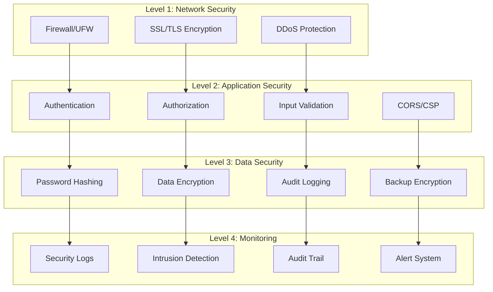

# 🔐 Безопасность системы

Комплексное руководство по обеспечению безопасности приложения управления сметами.

## 🛡️ Архитектура безопасности

### Многоуровневая защита



## 🔑 Аутентификация и авторизация

### UUID Token Authentication

**Преимущества UUID токенов над JWT:**
- Невозможно подделать без доступа к БД
- Легко отозвать конкретный токен
- Контроль времени жизни на сервере
- Отслеживание активности по токенам

**Реализация:**
```python
# backend/api/authentication.py
class UUIDTokenAuthentication(BaseAuthentication):
    """
    Безопасная аутентификация через UUID токены
    """
    def authenticate(self, request):
        auth_header = request.META.get('HTTP_AUTHORIZATION')
        
        if not auth_header or not auth_header.startswith('Bearer '):
            return None
            
        token = auth_header[7:]  # Remove 'Bearer '
        client_ip = self.get_client_ip(request)
        
        try:
            # Валидация UUID формата
            uuid.UUID(token)
            
            # Поиск токена с проверкой активности пользователя
            auth_token = AuthToken.objects.select_related('user', 'user__role').get(
                token=token,
                user__is_active=True
            )
            
            # Обновление времени последнего использования
            auth_token.last_used = timezone.now()
            auth_token.last_ip = client_ip
            auth_token.save(update_fields=['last_used', 'last_ip'])
            
            # Логирование входа
            audit_logger.info(f"Successful authentication: {auth_token.user.email} from {client_ip}")
            
            return (auth_token.user, auth_token)
            
        except (ValueError, AuthToken.DoesNotExist):
            # Логирование неудачной попытки
            security_logger.warning(f"Failed authentication attempt from {client_ip} with token: {token[:8]}...")
            raise AuthenticationFailed('Invalid or expired token')
    
    def get_client_ip(self, request):
        """Получение IP адреса клиента"""
        x_forwarded_for = request.META.get('HTTP_X_FORWARDED_FOR')
        if x_forwarded_for:
            ip = x_forwarded_for.split(',')[0]
        else:
            ip = request.META.get('REMOTE_ADDR')
        return ip
```

### Модель токенов с безопасностью

```python
# backend/api/models.py
class AuthToken(models.Model):
    """
    Токены аутентификации с расширенными возможностями безопасности
    """
    id = models.UUIDField(primary_key=True, default=uuid.uuid4, editable=False)
    token = models.UUIDField(unique=True, default=uuid.uuid4, editable=False)
    user = models.ForeignKey(User, on_delete=models.CASCADE, related_name='tokens')
    
    # Временные ограничения
    created_at = models.DateTimeField(auto_now_add=True)
    last_used = models.DateTimeField(auto_now=True)
    expires_at = models.DateTimeField(null=True, blank=True)
    
    # Информация о сессии
    user_agent = models.TextField(blank=True)
    last_ip = models.GenericIPAddressField(null=True, blank=True)
    
    # Флаги безопасности
    is_active = models.BooleanField(default=True)
    force_logout = models.BooleanField(default=False)  # Принудительный выход
    
    class Meta:
        db_table = 'auth_tokens'
        indexes = [
            models.Index(fields=['token']),
            models.Index(fields=['user', 'is_active']),
            models.Index(fields=['last_used']),
        ]
    
    def is_expired(self):
        """Проверка истечения срока действия токена"""
        if self.expires_at and self.expires_at < timezone.now():
            return True
        
        # Автоматическое истечение после 30 дней неактивности
        if self.last_used < timezone.now() - timedelta(days=30):
            return True
            
        return False
    
    def revoke(self):
        """Отзыв токена"""
        self.is_active = False
        self.save(update_fields=['is_active'])
        audit_logger.info(f"Token revoked for user {self.user.email}")
```

### Ролевая система доступа

**Кастомные разрешения:**
```python
# backend/api/permissions.py
class IsManager(BasePermission):
    """Доступ только для менеджеров"""
    def has_permission(self, request, view):
        return (
            request.user.is_authenticated and 
            request.user.role and 
            request.user.role.name == 'менеджер'
        )

class CanAccessEstimate(BasePermission):
    """Контроль доступа к сметам по ролям"""
    def has_object_permission(self, request, view, obj):
        user = request.user
        
        # Менеджеры имеют доступ ко всем сметам
        if user.role.name == 'менеджер':
            return True
        
        # Прорабы могут видеть только свои сметы или сметы назначенных проектов
        if user.role.name == 'прораб':
            if obj.foreman == user:
                return True
            
            # Проверка назначения на проект
            return ProjectAssignment.objects.filter(
                project=obj.project,
                user=user
            ).exists()
        
        return False

class RateLimitPermission(BasePermission):
    """Ограничение частоты запросов"""
    def has_permission(self, request, view):
        cache_key = f"rate_limit_{request.user.id}_{view.__class__.__name__}"
        requests_count = cache.get(cache_key, 0)
        
        # Лимит: 100 запросов в минуту
        if requests_count >= 100:
            security_logger.warning(f"Rate limit exceeded for user {request.user.email}")
            return False
        
        cache.set(cache_key, requests_count + 1, 60)  # 1 минута
        return True
```

## 🛡️ Защита от атак

### CSRF Protection

**Django CSRF middleware:**
```python
# backend/core/settings_production.py
MIDDLEWARE = [
    'corsheaders.middleware.CorsMiddleware',
    'django.middleware.security.SecurityMiddleware',
    'django.middleware.common.CommonMiddleware',
    'django.middleware.csrf.CsrfViewMiddleware',  # CSRF защита
    'django.contrib.auth.middleware.AuthenticationMiddleware',
    'django.middleware.clickjacking.XFrameOptionsMiddleware',
]

# CSRF настройки
CSRF_COOKIE_SECURE = True  # Только через HTTPS
CSRF_COOKIE_HTTPONLY = True  # Не доступно из JavaScript
CSRF_COOKIE_SAMESITE = 'Strict'  # Строгая SameSite политика
CSRF_TRUSTED_ORIGINS = [
    'https://app.iqbs.pro',
    'https://iqbs.pro'
]
```

### XSS Protection

**Content Security Policy:**
```python
# backend/core/settings_production.py
SECURE_CONTENT_TYPE_NOSNIFF = True
SECURE_BROWSER_XSS_FILTER = True
X_FRAME_OPTIONS = 'DENY'

# CSP заголовки
CSP_DEFAULT_SRC = ("'self'",)
CSP_SCRIPT_SRC = ("'self'", "'unsafe-inline'")  # Минимально необходимое для React
CSP_STYLE_SRC = ("'self'", "'unsafe-inline'", "fonts.googleapis.com")
CSP_FONT_SRC = ("'self'", "fonts.gstatic.com")
CSP_IMG_SRC = ("'self'", "data:", "blob:")
CSP_CONNECT_SRC = ("'self'", "https://app.iqbs.pro")
```

**Валидация входных данных:**
```python
# backend/api/serializers.py
import bleach
from django.core.validators import RegexValidator

class EstimateSerializer(serializers.ModelSerializer):
    # Валидация имени сметы
    name = serializers.CharField(
        max_length=255,
        validators=[
            RegexValidator(
                regex=r'^[a-zA-Zа-яА-Я0-9\s\-_\.]+$',
                message='Имя может содержать только буквы, цифры, пробелы и символы -_.'
            )
        ]
    )
    
    def validate_description(self, value):
        """Очистка описания от XSS"""
        if value:
            # Разрешенные HTML теги
            allowed_tags = ['p', 'br', 'strong', 'em', 'ul', 'ol', 'li']
            cleaned_value = bleach.clean(value, tags=allowed_tags, strip=True)
            return cleaned_value
        return value
    
    def validate_total_cost(self, value):
        """Валидация стоимости"""
        if value < 0:
            raise serializers.ValidationError("Стоимость не может быть отрицательной")
        if value > 999999999.99:
            raise serializers.ValidationError("Стоимость слишком большая")
        return value
```

### SQL Injection Prevention

**Использование Django ORM:**
```python
# ✅ Безопасно - Django ORM автоматически экранирует
def get_estimates_by_project(project_id):
    return Estimate.objects.filter(project_id=project_id)

# ✅ Безопасно - параметризованные запросы
def get_estimates_with_total():
    return Estimate.objects.extra(
        select={'total': 'SELECT SUM(total_price) FROM estimate_items WHERE estimate_id = api_estimate.id'},
        params=[]
    )

# ❌ Небезопасно - прямая конкатенация (НЕ ИСПОЛЬЗУЕТСЯ)
def unsafe_query(user_input):
    # Такой код запрещен в проекте
    cursor.execute(f"SELECT * FROM estimates WHERE name = '{user_input}'")
```

### Brute Force Protection

**Rate limiting middleware:**
```python
# backend/api/middleware.py
class BruteForceProtectionMiddleware:
    """Защита от брутфорс атак"""
    
    def __init__(self, get_response):
        self.get_response = get_response
    
    def __call__(self, request):
        if request.path == '/api/v1/auth/login/' and request.method == 'POST':
            client_ip = self.get_client_ip(request)
            cache_key = f"login_attempts_{client_ip}"
            
            attempts = cache.get(cache_key, 0)
            
            # Блокировка после 5 неудачных попыток
            if attempts >= 5:
                security_logger.warning(f"Brute force attempt blocked from {client_ip}")
                return JsonResponse(
                    {'error': 'Too many login attempts. Try again later.'},
                    status=429
                )
        
        response = self.get_response(request)
        
        # Увеличиваем счетчик при неудачной авторизации
        if (request.path == '/api/v1/auth/login/' and 
            request.method == 'POST' and 
            response.status_code == 400):
            
            client_ip = self.get_client_ip(request)
            cache_key = f"login_attempts_{client_ip}"
            attempts = cache.get(cache_key, 0) + 1
            cache.set(cache_key, attempts, 300)  # 5 минут блокировки
        
        return response
```

## 🔒 Шифрование данных

### Хеширование паролей

```python
# backend/api/models.py
from django.contrib.auth.hashers import make_password, check_password
import secrets

class User(models.Model):
    email = models.EmailField(unique=True)
    password_hash = models.CharField(max_length=255)
    
    def set_password(self, raw_password):
        """Безопасное хеширование пароля"""
        # Добавление соли для дополнительной безопасности
        salt = secrets.token_hex(16)
        self.password_hash = make_password(raw_password + salt)
        self.salt = salt
    
    def check_password(self, raw_password):
        """Проверка пароля"""
        return check_password(raw_password + self.salt, self.password_hash)
    
    def generate_secure_token(self):
        """Генерация криптографически стойкого токена"""
        return secrets.token_urlsafe(32)
```

### Шифрование чувствительных данных

```python
# backend/api/utils.py
from cryptography.fernet import Fernet
from django.conf import settings
import base64

class DataEncryption:
    """Шифрование чувствительных данных"""
    
    def __init__(self):
        key = settings.ENCRYPTION_KEY.encode()
        self.cipher = Fernet(base64.urlsafe_b64encode(key[:32]))
    
    def encrypt(self, data: str) -> str:
        """Шифрование строки"""
        if not data:
            return data
        return self.cipher.encrypt(data.encode()).decode()
    
    def decrypt(self, encrypted_data: str) -> str:
        """Расшифровка строки"""
        if not encrypted_data:
            return encrypted_data
        return self.cipher.decrypt(encrypted_data.encode()).decode()

# Использование для чувствительных полей
class PaymentInfo(models.Model):
    bank_account = models.TextField()  # Зашифрованный номер счета
    
    def set_bank_account(self, account_number):
        encryptor = DataEncryption()
        self.bank_account = encryptor.encrypt(account_number)
    
    def get_bank_account(self):
        encryptor = DataEncryption()
        return encryptor.decrypt(self.bank_account)
```

## 📊 Аудит и мониторинг

### Система аудита

**Модель аудита:**
```python
# backend/api/models.py
class AuditLog(models.Model):
    """Журнал аудита для отслеживания всех действий"""
    
    ACTION_TYPES = [
        ('CREATE', 'Создание'),
        ('UPDATE', 'Изменение'),
        ('DELETE', 'Удаление'),
        ('LOGIN', 'Вход в систему'),
        ('LOGOUT', 'Выход из системы'),
        ('EXPORT', 'Экспорт данных'),
        ('IMPORT', 'Импорт данных'),
        ('ACCESS_DENIED', 'Отказ в доступе'),
    ]
    
    id = models.UUIDField(primary_key=True, default=uuid.uuid4)
    timestamp = models.DateTimeField(auto_now_add=True)
    user = models.ForeignKey(User, on_delete=models.SET_NULL, null=True)
    action_type = models.CharField(max_length=20, choices=ACTION_TYPES)
    resource_type = models.CharField(max_length=50)  # 'Estimate', 'Project', etc.
    resource_id = models.UUIDField(null=True, blank=True)
    ip_address = models.GenericIPAddressField()
    user_agent = models.TextField()
    details = models.JSONField(default=dict)
    
    class Meta:
        db_table = 'audit_logs'
        indexes = [
            models.Index(fields=['timestamp', 'user']),
            models.Index(fields=['action_type', 'resource_type']),
            models.Index(fields=['ip_address']),
        ]
```

**Декораторы аудита:**
```python
# backend/api/security_decorators.py
def audit_critical_action(action_type, resource_type=None):
    """Декоратор для аудита критических действий"""
    def decorator(view_func):
        @wraps(view_func)
        def wrapper(request, *args, **kwargs):
            start_time = time.time()
            
            try:
                # Выполнение действия
                result = view_func(request, *args, **kwargs)
                
                # Логирование успешного действия
                AuditLog.objects.create(
                    user=request.user if request.user.is_authenticated else None,
                    action_type=action_type,
                    resource_type=resource_type or view_func.__name__,
                    resource_id=kwargs.get('pk'),
                    ip_address=get_client_ip(request),
                    user_agent=request.META.get('HTTP_USER_AGENT', ''),
                    details={
                        'method': request.method,
                        'path': request.path,
                        'duration': time.time() - start_time,
                        'status': 'success'
                    }
                )
                
                return result
                
            except Exception as e:
                # Логирование ошибок
                AuditLog.objects.create(
                    user=request.user if request.user.is_authenticated else None,
                    action_type='ERROR',
                    resource_type=resource_type or view_func.__name__,
                    resource_id=kwargs.get('pk'),
                    ip_address=get_client_ip(request),
                    user_agent=request.META.get('HTTP_USER_AGENT', ''),
                    details={
                        'method': request.method,
                        'path': request.path,
                        'error': str(e),
                        'duration': time.time() - start_time,
                        'status': 'error'
                    }
                )
                raise
        
        return wrapper
    return decorator

# Применение декоратора
@audit_critical_action('DELETE', 'Estimate')
def delete_estimate(request, pk):
    estimate = get_object_or_404(Estimate, pk=pk)
    estimate.delete()
    return Response(status=204)
```

### Логирование безопасности

**Конфигурация логов:**
```python
# backend/core/settings_production.py
LOGGING = {
    'version': 1,
    'disable_existing_loggers': False,
    'formatters': {
        'security': {
            'format': '[SECURITY] {asctime} {levelname} {module} {message}',
            'style': '{',
        },
        'audit': {
            'format': '[AUDIT] {asctime} {levelname} {message}',
            'style': '{',
        },
    },
    'handlers': {
        'security_console': {
            'level': 'WARNING',
            'class': 'logging.StreamHandler',
            'formatter': 'security',
        },
        'audit_console': {
            'level': 'INFO',
            'class': 'logging.StreamHandler',
            'formatter': 'audit',
        },
    },
    'loggers': {
        'security': {
            'handlers': ['security_console'],
            'level': 'WARNING',
            'propagate': False,
        },
        'audit': {
            'handlers': ['audit_console'],
            'level': 'INFO',
            'propagate': False,
        },
    },
}
```

### Мониторинг в реальном времени

**Скрипт мониторинга:**
```bash
#!/bin/bash
# security-monitor.sh

LOG_FILE="/var/log/security-monitor.log"
ALERT_EMAIL="security@iqbs.pro"

monitor_security_events() {
    # Мониторинг подозрительной активности
    tail -F /var/log/nginx/app.iqbs.pro.access.log | while read line; do
        # Множественные 401/403 ошибки с одного IP
        ip=$(echo $line | awk '{print $1}')
        status=$(echo $line | awk '{print $9}')
        
        if [[ "$status" == "401" || "$status" == "403" ]]; then
            count=$(grep -c "$ip.*40[13]" /var/log/nginx/app.iqbs.pro.access.log | tail -100)
            
            if [ $count -gt 10 ]; then
                echo "$(date): Suspicious activity from $ip - $count failed attempts" >> $LOG_FILE
                # Блокировка IP через fail2ban
                fail2ban-client set nginx-req-limit banip $ip
                
                # Отправка уведомления
                echo "Blocked suspicious IP: $ip" | mail -s "Security Alert" $ALERT_EMAIL
            fi
        fi
    done
}

# Мониторинг аномальной нагрузки
monitor_load() {
    while true; do
        load=$(docker stats --no-stream --format "{{.CPUPerc}}" estimate-backend | sed 's/%//')
        
        if (( $(echo "$load > 80" | bc -l) )); then
            echo "$(date): High CPU load detected: $load%" >> $LOG_FILE
            
            # Проверка на DDoS
            connections=$(netstat -an | grep :443 | wc -l)
            if [ $connections -gt 1000 ]; then
                echo "$(date): Possible DDoS attack - $connections connections" >> $LOG_FILE
                # Активация защиты от DDoS
                # ./activate-ddos-protection.sh
            fi
        fi
        
        sleep 30
    done
}

# Запуск мониторинга
monitor_security_events &
monitor_load &
```

## 🚨 Инцидент-реагирование

### План реагирования на инциденты

**1. Обнаружение:**
- Автоматические алерты системы мониторинга
- Уведомления от пользователей
- Регулярные security аудиты

**2. Оценка:**
```bash
#!/bin/bash
# incident-assessment.sh

assess_security_incident() {
    echo "=== ОЦЕНКА ИНЦИДЕНТА БЕЗОПАСНОСТИ ==="
    echo "Время: $(date)"
    
    # Проверка активных подключений
    echo "Активные соединения:"
    netstat -an | grep :443 | wc -l
    
    # Последние логи аутентификации
    echo "Последние попытки входа:"
    docker logs estimate-backend | grep "authentication" | tail -20
    
    # Проверка файловой системы
    echo "Изменения в критических файлах:"
    find /var/www/estimate-app -name "*.py" -newer /tmp/last-check 2>/dev/null
    
    # Анализ трафика
    echo "Подозрительный трафик:"
    tail -1000 /var/log/nginx/app.iqbs.pro.access.log | \
    awk '{print $1}' | sort | uniq -c | sort -nr | head -10
}
```

**3. Реагирование:**
```bash
#!/bin/bash
# incident-response.sh

emergency_lockdown() {
    echo "🚨 АКТИВАЦИЯ АВАРИЙНОГО РЕЖИМА"
    
    # Блокировка подозрительного трафика
    iptables -A INPUT -p tcp --dport 443 -m connlimit --connlimit-above 10 -j DROP
    
    # Переключение в режим "только чтение"
    docker exec estimate-backend python manage.py shell -c "
    from django.conf import settings
    settings.READ_ONLY_MODE = True
    "
    
    # Создание резервной копии
    backup_timestamp=$(date +%Y%m%d_%H%M%S)
    docker exec estimate-postgres pg_dump -U estimate_user estimate_app_db > \
        "/var/backups/emergency_backup_$backup_timestamp.sql"
    
    # Уведомление команды
    echo "Emergency lockdown activated at $(date)" | \
        mail -s "🚨 SECURITY INCIDENT" security@iqbs.pro
}
```

### Восстановление после инцидента

**1. Анализ ущерба:**
```python
# security-damage-assessment.py
def assess_data_integrity():
    """Проверка целостности данных после инцидента"""
    
    # Проверка контрольных сумм критических записей
    estimates = Estimate.objects.all()
    for estimate in estimates:
        expected_total = sum(item.total_price for item in estimate.estimate_items.all())
        if abs(estimate.total_cost - expected_total) > 0.01:
            print(f"Data integrity issue in estimate {estimate.id}")
    
    # Проверка аудит логов на пропуски
    audit_logs = AuditLog.objects.filter(
        timestamp__gte=timezone.now() - timedelta(hours=24)
    ).order_by('timestamp')
    
    # Поиск подозрительных паттернов
    suspicious_activities = AuditLog.objects.filter(
        action_type='DELETE',
        timestamp__gte=timezone.now() - timedelta(hours=1)
    ).count()
    
    if suspicious_activities > 10:
        print(f"⚠️ Unusual deletion activity: {suspicious_activities} deletions in last hour")
```

**2. Восстановление данных:**
```bash
#!/bin/bash
# data-recovery.sh

restore_from_backup() {
    backup_file=$1
    
    echo "Восстановление из резервной копии: $backup_file"
    
    # Остановка приложения
    docker-compose down
    
    # Восстановление БД
    docker run --rm -v $(pwd):/backup postgres:15 \
        psql -h host.docker.internal -U estimate_user -d estimate_app_db \
        -f /backup/$backup_file
    
    # Запуск приложения
    docker-compose up -d
    
    # Проверка целостности
    python security-damage-assessment.py
}
```

## 🔧 Конфигурация безопасности

### SSL/TLS настройки

**Nginx SSL конфигурация:**
```nginx
# /etc/nginx/sites-available/app.iqbs.pro-ssl.conf
server {
    listen 443 ssl http2;
    server_name app.iqbs.pro;

    # SSL сертификаты
    ssl_certificate /etc/letsencrypt/live/app.iqbs.pro/fullchain.pem;
    ssl_certificate_key /etc/letsencrypt/live/app.iqbs.pro/privkey.pem;

    # Современные SSL настройки
    ssl_protocols TLSv1.2 TLSv1.3;
    ssl_ciphers ECDHE-RSA-AES256-GCM-SHA512:DHE-RSA-AES256-GCM-SHA512:ECDHE-RSA-AES256-GCM-SHA384:DHE-RSA-AES256-GCM-SHA384:ECDHE-RSA-AES256-SHA384;
    ssl_prefer_server_ciphers off;
    ssl_session_cache shared:SSL:10m;
    ssl_session_timeout 10m;
    ssl_session_tickets off;

    # OCSP Stapling
    ssl_stapling on;
    ssl_stapling_verify on;

    # Security headers
    add_header Strict-Transport-Security "max-age=31536000; includeSubDomains; preload" always;
    add_header X-Frame-Options "DENY" always;
    add_header X-Content-Type-Options "nosniff" always;
    add_header X-XSS-Protection "1; mode=block" always;
    add_header Referrer-Policy "strict-origin-when-cross-origin" always;
    add_header Content-Security-Policy "default-src 'self'; script-src 'self' 'unsafe-inline'; style-src 'self' 'unsafe-inline' fonts.googleapis.com; font-src 'self' fonts.gstatic.com; img-src 'self' data: blob:; connect-src 'self' https://app.iqbs.pro;" always;
    
    # Отключение вредных методов
    if ($request_method !~ ^(GET|HEAD|POST|PUT|DELETE|OPTIONS)$ ) {
        return 405;
    }
}
```

### Firewall настройки

```bash
#!/bin/bash
# firewall-setup.sh

setup_firewall() {
    echo "Настройка firewall..."
    
    # Базовые правила UFW
    ufw --force reset
    ufw default deny incoming
    ufw default allow outgoing
    
    # Разрешенные сервисы
    ufw allow ssh
    ufw allow 80/tcp   # HTTP
    ufw allow 443/tcp  # HTTPS
    
    # Ограничение SSH
    ufw limit ssh/tcp
    
    # Защита от port scanning
    ufw deny 23      # Telnet
    ufw deny 135     # RPC
    ufw deny 137:139 # NetBIOS
    ufw deny 445     # SMB
    
    # Активация
    ufw --force enable
    
    echo "Firewall настроен"
}

# Fail2ban настройка
setup_fail2ban() {
    echo "Настройка Fail2ban..."
    
    cat > /etc/fail2ban/jail.local << 'EOF'
[DEFAULT]
bantime = 3600
findtime = 600
maxretry = 5
backend = auto

[sshd]
enabled = true
port = ssh
logpath = /var/log/auth.log

[nginx-req-limit]
enabled = true
filter = nginx-req-limit
action = iptables-multiport[name=ReqLimit, port="http,https", protocol=tcp]
logpath = /var/log/nginx/app.iqbs.pro.access.log
findtime = 600
bantime = 7200
maxretry = 10

[nginx-login]
enabled = true
filter = nginx-login
action = iptables-multiport[name=LoginLimit, port="http,https", protocol=tcp]
logpath = /var/log/nginx/app.iqbs.pro.access.log
findtime = 600
bantime = 3600
maxretry = 5
EOF

    systemctl enable fail2ban
    systemctl restart fail2ban
    
    echo "Fail2ban настроен"
}
```

## 📋 Чек-лист безопасности

### Ежедневные проверки

- [ ] Проверка логов безопасности
- [ ] Мониторинг подозрительной активности
- [ ] Контроль доступных ресурсов
- [ ] Проверка статуса SSL сертификатов

### Еженедельные задачи

- [ ] Анализ аудит логов
- [ ] Обновление системы и зависимостей
- [ ] Проверка резервных копий
- [ ] Тестирование процедур восстановления

### Ежемесячные задачи

- [ ] Полный security аудит
- [ ] Ротация паролей администраторов
- [ ] Обновление security политик
- [ ] Тестирование incident response плана

### Ежеквартальные задачи

- [ ] Penetration testing
- [ ] Обзор архитектуры безопасности
- [ ] Обучение команды security best practices
- [ ] Сертификация соответствия стандартам

---

**Следующий раздел**: [📈 Мониторинг](./monitoring.md)